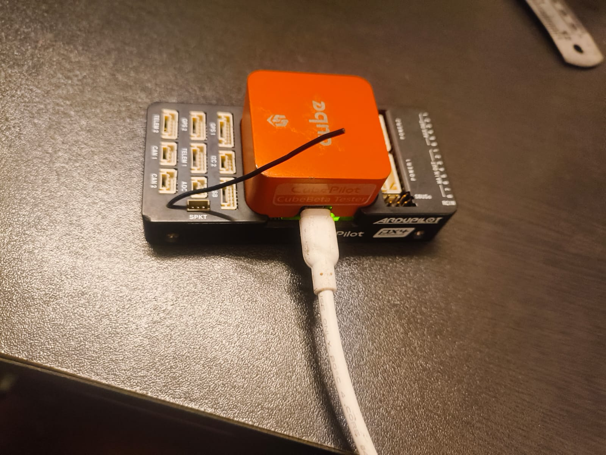

# MAVLink Data Viewer



A Python application that connects to a Pixhawk flight controller via USB and displays MAVLink data streams in real-time.

---

## Table of Contents

- [Overview](#overview)
- [Heartbeat Signal Format](#heartbeat-signal-format)
- [How the Code Works](#how-the-code-works)
- [Key Message Types Handled](#key-message-types-handled)
- [Why Heartbeats Matter](#why-heartbeats-matter)
- [Installation](#installation)
- [Usage](#usage)

---

## Overview

This program establishes a serial connection to a Pixhawk flight controller, initiates the MAVLink communication protocol using heartbeat signals, and continuously displays incoming telemetry data in a human-readable format.

---

## Heartbeat Signal Format

The heartbeat is sent using the `send_heartbeat()` method:

```python
self.connection.mav.heartbeat_send(
    mavutil.mavlink.MAV_TYPE_GCS,           # Type: Ground Control Station
    mavutil.mavlink.MAV_AUTOPILOT_INVALID,  # Autopilot type
    0,                                       # Base mode
    0,                                       # Custom mode
    mavutil.mavlink.MAV_STATE_ACTIVE        # System status
)
```

### MAVLink HEARTBEAT Message Fields

| Field | Value in Code | Description |
|-------|---------------|-------------|
| **type** | `MAV_TYPE_GCS` (6) | Identifies sender as a Ground Control Station |
| **autopilot** | `MAV_AUTOPILOT_INVALID` (8) | No autopilot (we're the ground station) |
| **base_mode** | `0` | System mode flags (none set) |
| **custom_mode** | `0` | Autopilot-specific mode (none) |
| **system_status** | `MAV_STATE_ACTIVE` (4) | System is fully active |

The actual MAVLink packet also includes a header with:
- **System ID**: `255` (standard for ground stations)
- **Component ID**: `0`

---

## How the Code Works

The program follows this flow:

```
┌─────────────────┐     ┌─────────────────┐     ┌─────────────────┐     ┌─────────────────┐
│   1. Connect    │ ──▶ │  2. Handshake   │ ──▶ │ 3. Request Data │ ──▶ │ 4. Stream Loop  │
│   to Pixhawk    │     │   (Heartbeats)  │     │     Streams     │     │  (Read/Display) │
└─────────────────┘     └─────────────────┘     └─────────────────┘     └─────────────────┘
```

### Step 1: Connection (`connect()`)

- Opens a serial connection to the Pixhawk on the specified COM port (default: `COM13`) at `115200` baud
- Identifies itself as system ID `255` (standard for ground stations)

### Step 2: Heartbeat Handshake (`wait_for_heartbeat()`)

- Sends heartbeats repeatedly to "wake up" the Pixhawk
- Waits up to 60 seconds for the Pixhawk to respond with its own heartbeat
- The Pixhawk won't stream data until it sees a valid ground station heartbeat

### Step 3: Request Data Streams (`request_data_stream()`)

- Sends a `REQUEST_DATA_STREAM` command asking for **all** data streams at **4 Hz**
- This tells the Pixhawk to start broadcasting sensor data, GPS, attitude, etc.

### Step 4: Main Loop (`run()`)

- **Sends heartbeat every 1 second** to keep the connection alive
- **Receives incoming messages** using `recv_match()`
- **Formats and displays** each message type with human-readable output
- Filters out noisy messages like `TIMESYNC` and `SYSTEM_TIME`
- Continues until user presses `Ctrl+C`

---

## Key Message Types Handled

The code has special formatting for these message types:

| Message Type | Data Displayed |
|--------------|----------------|
| `HEARTBEAT` | Type, autopilot, mode, status |
| `ATTITUDE` | Roll, pitch, yaw (in degrees) |
| `GPS_RAW_INT` | Lat, lon, altitude, fix type, satellites |
| `SYS_STATUS` | Battery voltage, current, remaining % |
| `VFR_HUD` | Airspeed, groundspeed, heading, throttle |
| `GLOBAL_POSITION_INT` | Position and velocity |
| `RAW_IMU` | Accelerometer, gyro, magnetometer raw values |
| `SCALED_PRESSURE` | Barometric pressure and temperature |
| `RC_CHANNELS` | RC input channel values |
| `SERVO_OUTPUT_RAW` | Servo PWM outputs |
| `BATTERY_STATUS` | Detailed battery info |
| `STATUSTEXT` | Text messages/warnings from autopilot |
| `PARAM_VALUE` | Parameter name and value |

Any other message types are displayed with their raw field values.

---

## Why Heartbeats Matter

The heartbeat is crucial because:

1. **MAVLink requires mutual heartbeats** - The Pixhawk won't stream data until it knows a ground station is listening
2. **Connection keepalive** - If heartbeats stop for too long, the Pixhawk may stop sending data
3. **System identification** - It tells each side who the other is (system ID, type, status)

---

## Installation

### Prerequisites

- Python 3.x
- Pixhawk flight controller connected via USB

### Install Dependencies

```bash
pip install pymavlink
```

---

## Usage

### Basic Usage (Default: COM13, 115200 baud)

```bash
python mavlink_viewer.py
```

### Specify COM Port and Baud Rate

```bash
python mavlink_viewer.py --port COM5 --baud 57600
```

### Command Line Arguments

| Argument | Short | Default | Description |
|----------|-------|---------|-------------|
| `--port` | `-p` | `COM13` | COM port where Pixhawk is connected |
| `--baud` | `-b` | `115200` | Baud rate for serial communication |

### Stopping the Program

Press `Ctrl+C` to stop the data stream and close the connection gracefully.

---

## Author

Created for Pixhawk Cube flight controller communication.
